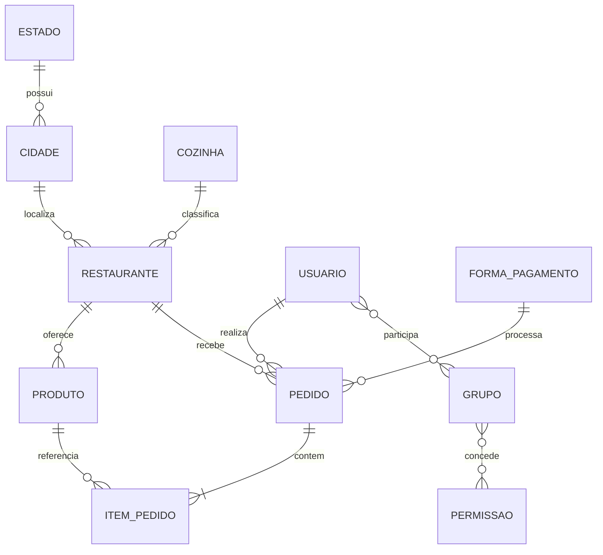

# FreecsFood API

API REST que representa a base de um aplicativo de entrega de comida. O projeto foi criado para praticar relacionamentos JPA, regras de negócio, segurança, migrations e contratos HTTP sem tentar reproduzir toda a complexidade de uma plataforma comercial.

Atualmente, a API disponibiliza operações para **cozinhas**, **estados**, **cidades** e **restaurantes**. As demais entidades do domínio, como pedidos, produtos, usuários, grupos e formas de pagamento, fazem parte do modelo de dados, mas ainda não possuem endpoints públicos.

## Tecnologias

- Java 21
- Spring Boot 3.5
- Spring Web e Bean Validation
- Spring Data JPA e Hibernate
- Spring Security com HTTP Basic e BCrypt
- MySQL e Flyway
- Maven Wrapper
- JUnit 5, MockMvc e Testcontainers

## Pré-requisitos

Antes de iniciar, instale:

- JDK 21
- MySQL 8 ou superior
- Docker, opcional, para executar os testes de integração com Testcontainers

Não é necessário instalar o Maven: o projeto inclui o Maven Wrapper (`mvnw` e `mvnw.cmd`).

## Configuração do banco de dados

Por padrão, a aplicação tenta acessar:

```text
jdbc:mysql://localhost:3306/freecsfood?createDatabaseIfNotExist=true&serverTimezone=UTC
usuário: freecsfood
senha: vazia
```

É recomendável criar um usuário exclusivo para a aplicação:

```sql
CREATE DATABASE freecsfood
    CHARACTER SET utf8mb4
    COLLATE utf8mb4_unicode_ci;

CREATE USER 'freecsfood'@'localhost' IDENTIFIED BY 'troque-por-uma-senha-segura';
GRANT ALL PRIVILEGES ON freecsfood.* TO 'freecsfood'@'localhost';
FLUSH PRIVILEGES;
```

Se o usuário possuir permissão para criar bancos, o parâmetro `createDatabaseIfNotExist=true` também permite que o MySQL crie o banco automaticamente.

Na primeira inicialização, o Flyway executa a migration em `src/main/resources/db/migration`, cria toda a estrutura e insere dados iniciais para uso da API. O Hibernate apenas valida o schema; ele não cria ou altera tabelas automaticamente.

Os dados iniciais incluem:

- permissões e grupo de administradores;
- estados e cidades de exemplo;
- cozinhas e formas de pagamento;
- restaurantes, produtos e suas associações.

O Flyway não grava uma senha fixa. O usuário `admin@freecsfood.local` é criado pelo perfil `dev` com a senha recebida em `DEV_ADMIN_PASSWORD`.

## Variáveis de ambiente

| Variável | Obrigatória | Valor padrão | Finalidade |
|---|---:|---|---|
| `DB_URL` | Não | URL local do banco `freecsfood` | URL JDBC do MySQL |
| `DB_USERNAME` | Não | `freecsfood` | Usuário do banco |
| `DB_PASSWORD` | Sim, se o banco exigir | Vazio | Senha do banco |
| `SPRING_PROFILES_ACTIVE` | Para dados de desenvolvimento | Nenhum | Perfis ativos do Spring |
| `DEV_ADMIN_PASSWORD` | Com o perfil `dev` | Vazio | Senha inicial do administrador |
| `CORS_ALLOWED_ORIGINS` | Não | `http://localhost:3000` | Origens CORS, separadas por vírgula |
| `JPA_SHOW_SQL` | Não | `false` | Exibe SQL no console |

O arquivo [`.env.example`](.env.example) contém um modelo, mas o Spring Boot não carrega arquivos `.env` automaticamente. Exporte as variáveis no terminal, configure-as na IDE ou use um gerenciador de ambiente.

### PowerShell

```powershell
$env:DB_USERNAME = "freecsfood"
$env:DB_PASSWORD = "troque-por-uma-senha-segura"
$env:SPRING_PROFILES_ACTIVE = "dev"
$env:DEV_ADMIN_PASSWORD = "troque-por-outra-senha-segura"
./mvnw.cmd spring-boot:run
```

### Linux ou macOS

```bash
export DB_USERNAME=freecsfood
export DB_PASSWORD='troque-por-uma-senha-segura'
export SPRING_PROFILES_ACTIVE=dev
export DEV_ADMIN_PASSWORD='troque-por-outra-senha-segura'
./mvnw spring-boot:run
```

### Arquivo local do Spring

Como alternativa, crie `src/main/resources/application-local.properties`:

```properties
spring.datasource.username=freecsfood
spring.datasource.password=troque-por-uma-senha-segura
app.dev.admin-password=troque-por-outra-senha-segura
```

Esse arquivo está ignorado pelo Git. Inicie os perfis exatamente na ordem `dev,local`, para que as configurações locais tenham precedência:

```powershell
./mvnw.cmd -Dspring-boot.run.profiles=dev,local spring-boot:run
```

No IntelliJ IDEA, informe `dev,local` no campo **Active profiles** da configuração de execução.

## Iniciando a API

Ao usar o perfil `dev` em um banco sem usuários, a aplicação cria um administrador de desenvolvimento:

```text
usuário: admin@freecsfood.local
senha: valor definido em DEV_ADMIN_PASSWORD
```

Depois que aparecer a mensagem de que a aplicação iniciou, a API estará disponível em:

```text
http://localhost:8080
```

Para verificar o funcionamento:

```bash
curl -u admin@freecsfood.local:SUA_SENHA \
  "http://localhost:8080/cozinhas?page=0&size=5&sort=nome,asc"
```

No PowerShell, use `curl.exe` para evitar o alias de `Invoke-WebRequest`:

```powershell
curl.exe -u "admin@freecsfood.local:SUA_SENHA" `
  "http://localhost:8080/cozinhas?page=0&size=5&sort=nome,asc"
```

## Autenticação e permissões

Todas as requisições exigem autenticação HTTP Basic. As senhas são armazenadas com BCrypt e nunca são retornadas nos DTOs da API.

| Operação | Permissão exigida |
|---|---|
| Consultar restaurantes | `CONSULTAR_RESTAURANTES` |
| Criar, alterar ou excluir restaurantes | `EDITAR_RESTAURANTES` |
| Criar, alterar ou excluir estados e cidades | `EDITAR_CIDADES` |
| Criar, alterar ou excluir cozinhas | `EDITAR_COZINHAS` |
| Outras consultas disponíveis | Usuário autenticado |

Uma credencial ausente ou inválida retorna `401 Unauthorized`. Um usuário autenticado sem a permissão necessária recebe `403 Forbidden`.

> HTTP Basic deve ser usado por HTTPS fora do ambiente local, pois a credencial acompanha todas as requisições. O perfil `dev` e seu administrador não devem ser usados em produção.

## Recursos e endpoints

Todos os corpos de requisição e resposta usam JSON.

| Método | Endpoint | Descrição | Sucesso |
|---|---|---|---:|
| `GET` | `/cozinhas` | Lista cozinhas | `200` |
| `GET` | `/cozinhas/{id}` | Busca uma cozinha | `200` |
| `POST` | `/cozinhas` | Cria uma cozinha | `201` |
| `PUT` | `/cozinhas/{id}` | Atualiza uma cozinha | `200` |
| `DELETE` | `/cozinhas/{id}` | Exclui uma cozinha | `204` |
| `GET` | `/estados` | Lista estados | `200` |
| `GET` | `/estados/{id}` | Busca um estado | `200` |
| `POST` | `/estados` | Cria um estado | `201` |
| `PUT` | `/estados/{id}` | Atualiza um estado | `200` |
| `DELETE` | `/estados/{id}` | Exclui um estado | `204` |
| `GET` | `/cidades` | Lista cidades | `200` |
| `GET` | `/cidades/{id}` | Busca uma cidade | `200` |
| `POST` | `/cidades` | Cria uma cidade | `201` |
| `PUT` | `/cidades/{id}` | Atualiza uma cidade | `200` |
| `DELETE` | `/cidades/{id}` | Exclui uma cidade | `204` |
| `GET` | `/restaurantes` | Lista restaurantes | `200` |
| `GET` | `/restaurantes/{id}` | Busca um restaurante | `200` |
| `POST` | `/restaurantes` | Cria um restaurante | `201` |
| `PUT` | `/restaurantes/{id}` | Atualiza um restaurante | `200` |
| `DELETE` | `/restaurantes/{id}` | Exclui um restaurante | `204` |

As respostas de criação incluem o cabeçalho `Location` com a URL do novo recurso.

## Exemplos de uso

Os exemplos abaixo consideram as variáveis auxiliares:

```bash
BASE_URL=http://localhost:8080
AUTH=admin@freecsfood.local:SUA_SENHA
```

### Criar uma cozinha

```bash
curl -u "$AUTH" -X POST "$BASE_URL/cozinhas" \
  -H "Content-Type: application/json" \
  -d '{"nome":"Brasileira"}'
```

Resposta:

```json
{
  "id": 1,
  "nome": "Brasileira"
}
```

### Criar um estado

```bash
curl -u "$AUTH" -X POST "$BASE_URL/estados" \
  -H "Content-Type: application/json" \
  -d '{"nome":"São Paulo"}'
```

### Criar uma cidade

A cidade referencia um estado existente por `estadoId`:

```bash
curl -u "$AUTH" -X POST "$BASE_URL/cidades" \
  -H "Content-Type: application/json" \
  -d '{"nome":"Campinas","estadoId":1}'
```

Resposta:

```json
{
  "id": 1,
  "nome": "Campinas",
  "estado": {
    "id": 1,
    "nome": "São Paulo"
  }
}
```

### Criar um restaurante

O restaurante referencia uma cozinha existente por `cozinhaId`. Valores monetários usam duas casas decimais.

```bash
curl -u "$AUTH" -X POST "$BASE_URL/restaurantes" \
  -H "Content-Type: application/json" \
  -d '{"nome":"Sabor da Casa","taxaFrete":8.50,"cozinhaId":1}'
```

Resposta:

```json
{
  "id": 1,
  "nome": "Sabor da Casa",
  "taxaFrete": 8.50,
  "cozinha": {
    "id": 1,
    "nome": "Brasileira"
  }
}
```

### Atualizar e excluir

O `PUT` substitui os campos editáveis do recurso:

```bash
curl -u "$AUTH" -X PUT "$BASE_URL/cozinhas/1" \
  -H "Content-Type: application/json" \
  -d '{"nome":"Cozinha brasileira"}'

curl -u "$AUTH" -X DELETE "$BASE_URL/cozinhas/1"
```

A exclusão pode retornar `409 Conflict` quando o recurso ainda está relacionado a outro registro.

## Paginação e ordenação

Os endpoints de listagem aceitam:

- `page`: página iniciada em zero;
- `size`: quantidade de registros por página;
- `sort`: campo e direção, por exemplo `nome,asc` ou `nome,desc`.

Exemplo:

```text
GET /restaurantes?page=0&size=10&sort=nome,asc
```

Resposta paginada:

```json
{
  "content": [],
  "page": 0,
  "size": 10,
  "totalElements": 0,
  "totalPages": 0
}
```

Quando não informados, os valores padrão são `page=0`, `size=20` e ordenação por `nome`.

## Erros da API

Os erros seguem o padrão Problem Details e usam o tipo de mídia `application/problem+json`.

Exemplo de validação:

```json
{
  "type": "https://freecsfood.com.br/problems/dados-invalidos",
  "title": "Dados inválidos",
  "status": 400,
  "detail": "Um ou mais campos estão inválidos.",
  "fields": [
    {
      "field": "nome",
      "message": "não deve estar em branco"
    }
  ]
}
```

| Status | Significado |
|---:|---|
| `400` | JSON inválido, falha de validação ou regra de negócio violada |
| `401` | Credencial ausente ou inválida |
| `403` | Usuário sem permissão para a operação |
| `404` | Recurso não encontrado |
| `409` | Recurso em uso e impossibilitado de ser excluído |
| `500` | Erro interno inesperado |

Campos desconhecidos no JSON são rejeitados com `400`, ajudando a identificar erros de digitação no contrato.

## Modelo de domínio

As principais relações existentes no projeto são:



O diagrama mostra o domínio completo. Isso não significa que todas essas entidades já estejam expostas por endpoints.

## Estrutura do projeto

```text
src/main/java/br/com/jpslg/freecsfood
├── api
│   ├── assembler          # mapeamento entre entidades e DTOs
│   ├── controller         # endpoints REST
│   ├── exceptionhandler   # respostas Problem Details
│   └── model/dto          # contratos de entrada e saída
├── core
│   └── security           # autenticação, autorização e CORS
└── domain
    ├── exception          # exceções de domínio
    ├── model              # entidades JPA
    ├── repository         # acesso a dados
    └── service            # regras de negócio e transações

src/main/resources
├── db/migration           # migrations do Flyway
├── application.properties
└── application-dev.properties
```

## Testes

Execute toda a suíte:

```powershell
./mvnw.cmd clean test
```

No Linux ou macOS:

```bash
./mvnw clean test
```

A suíte contém testes unitários, testes HTTP com MockMvc e um teste de migration com MySQL via Testcontainers. O teste que depende de container é ignorado quando o Docker não está disponível.

Para analisar dependências declaradas e utilizadas:

```powershell
./mvnw.cmd dependency:analyze
```

## Problemas comuns

### `Access denied ... (using password: NO)`

A aplicação não recebeu a senha do MySQL. Defina `DB_PASSWORD` ou configure `spring.datasource.password` no arquivo `application-local.properties`. Confira também `DB_USERNAME` e `DB_URL`.

### O administrador de desenvolvimento não foi criado

Ative o perfil `dev`, defina uma senha não vazia em `DEV_ADMIN_PASSWORD` e use um banco sem usuários. Com arquivo local, mantenha a ordem de perfis `dev,local`.

### Erro de migration ou schema incompatível

Em um ambiente local descartável, pare a API, apague o banco `freecsfood`, crie-o novamente e reinicie a aplicação. Não apague ou altere migrations já aplicadas em ambientes compartilhados ou de produção; nesses casos, crie uma nova migration incremental.

### Porta 8080 ocupada

Encerre o processo que está usando a porta ou execute em outra porta:

```powershell
./mvnw.cmd -Dspring-boot.run.arguments="--server.port=8081" spring-boot:run
```

### Teste de migration ignorado

Inicie o Docker e execute os testes novamente. Os demais testes não dependem dele.

## Cuidados de segurança

- Nunca versione senhas, arquivos `.env` ou `application-local.properties`.
- Use credenciais diferentes para banco, administrador e ambientes distintos.
- Rotacione imediatamente qualquer segredo que tenha sido exposto no histórico Git.
- Restrinja `CORS_ALLOWED_ORIGINS` aos clientes autorizados.
- Use HTTPS e um mecanismo de autenticação apropriado antes de publicar a API.
- Não habilite o perfil `dev` em produção.

## Escopo atual

Este é um projeto pessoal a fim de demonstrar conceitos de arquitetura e desenvolvimento de software. O contrato pode evoluir enquanto novos conceitos são estudados. No estado atual, os endpoints públicos estão limitados a cozinhas, estados, cidades e restaurantes; em breve serão adicionados endpoints para pedidos, produtos, usuários, grupos, permissões ou formas de pagamento.

